# FortiGate Firewall Configuration Project

<p align="center">
  
  
  
</p>

## Overview

This project documents a FortiGate firewall configuration lab focused on secure network access, firewall policy design, VPN connectivity, identity-based access control, and FortiGate security profiles. The lab was performed in a virtual ENVARIO environment and includes practical configuration evidence exported from the original PDF report.

The goal of this project was to configure and validate core FortiGate features used in enterprise environments: administrator access control, SSL VPN, IPsec VPN, Virtual IP publishing, SSL/TLS inspection, web filtering, DNS filtering, antivirus inspection, IPS, and application control.

## Lab Environment

| Component | Description |
|---|---|
| Firewall | FortiGate VM / FortiOS web interface |
| Lab Platform | ENVARIO virtual lab environment |
| Directory Services | Windows Server with Active Directory / LDAP, domain `atlas.lab` |
| Client Endpoint | Windows 10 workstation |
| Remote Access | FortiClient VPN, SSL VPN Tunnel Mode, SSL VPN Web Mode, RDP |
| Web Service | IIS hosted on the internal server |
| Network Roles | WAN on `Port1`, LAN on `Port2` |

## Project Objectives

- Configure FortiGate administrator profiles and users using least-privilege access.
- Enforce password complexity requirements for administrative access.
- Integrate FortiGate with Active Directory through LDAP.
- Configure SSL VPN Tunnel Mode and Web Mode for remote RDP access.
- Publish an internal IIS portal through a FortiGate Virtual IP.
- Build a service-restricted site-to-site IPsec VPN.
- Apply FortiGate security profiles to outbound traffic and validate enforcement through testing and logs.

## Architecture Summary

The topology places FortiGate between the WAN and the internal LAN. The internal network contains a Windows workstation and an AtlasAD server. FortiGate controls traffic between internal assets, remote VPN users, and external destinations through firewall policies and security profiles.

| Direction | Control Point | Purpose |
|---|---|---|
| WAN to LAN | Virtual IP and firewall policy | Publish the internal IIS portal externally |
| Remote user to LAN | SSL VPN and RDP policy | Allow authenticated users to reach the Windows workstation |
| LAN to Internet | Outbound policy with security profiles | Inspect, filter, and block risky traffic |
| Site to site | IPsec VPN policies | Restrict cross-site traffic by service |

## FortiGate Overview and Network Topology

Built the lab around a FortiGate firewall placed between the external WAN and the internal LAN. Port1 was used as the WAN-facing interface and Port2 as the LAN-facing interface. The internal side included a Windows client and an AtlasAD domain server across separate internal subnets.

**Implemented controls:**

- WAN/LAN segmentation through FortiGate.
- Internal Windows workstation and Active Directory server.
- Two internal network ranges behind the firewall.

<details>
<summary>View configuration evidence - FortiGate Overview and Network Topology</summary>

<ol>
  <li><strong>Screenshot 1</strong><br>
    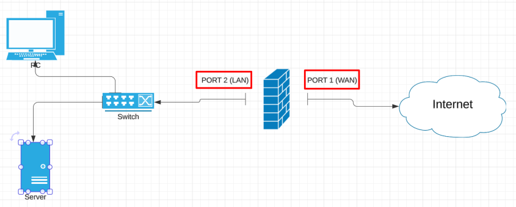
  </li>
  <li><strong>Screenshot 2</strong><br>
    
  </li>
</ol>

</details>

## User Management and RBAC

Created custom administrator profiles and users to demonstrate role-based access control. One administrator profile was based on Super_Admin-like privileges with selected restrictions, while the IT group received read-only access to specific operational areas such as policies, logs, VIPs, and interfaces.

**Implemented controls:**

- Created a restricted admin profile.
- Created dedicated administrator users.
- Implemented read-only access for IT users.

<details>
<summary>View configuration evidence - User Management and RBAC</summary>

<ol>
  <li><strong>Screenshot 1</strong><br>
    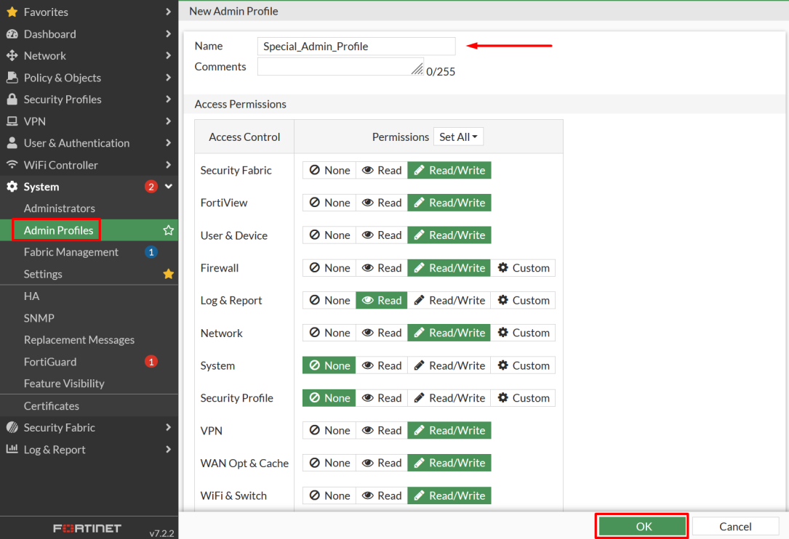
  </li>
  <li><strong>Screenshot 2</strong><br>
    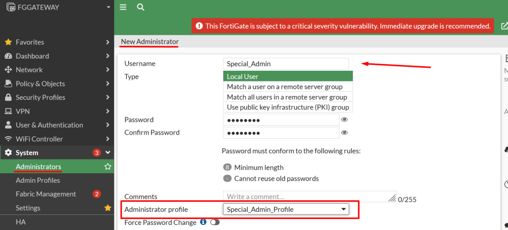
  </li>
  <li><strong>Screenshot 3</strong><br>
    
  </li>
  <li><strong>Screenshot 4</strong><br>
    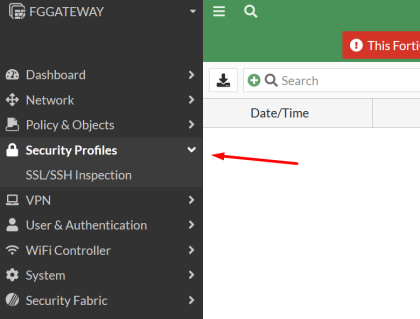
  </li>
  <li><strong>Screenshot 5</strong><br>
    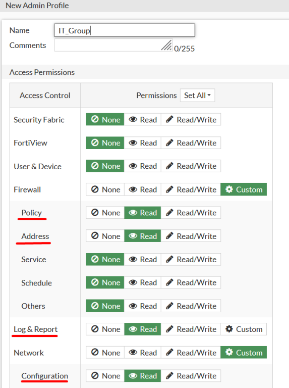
  </li>
  <li><strong>Screenshot 6</strong><br>
    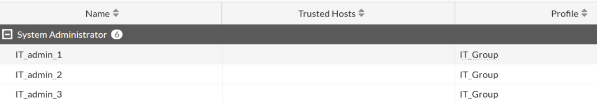
  </li>
  <li><strong>Screenshot 7</strong><br>
    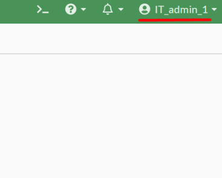
  </li>
  <li><strong>Screenshot 8</strong><br>
    
  </li>
</ol>

</details>

## Password Policy

Configured a password policy to enforce minimum password complexity across administrative users. The policy required a minimum length and a mix of uppercase, lowercase, numeric, and special characters.

**Implemented controls:**

- Minimum password length: 8 characters.
- Required uppercase, lowercase, numeric, and special characters.
- Reduced exposure to weak-password attacks.

<details>
<summary>View configuration evidence - Password Policy</summary>

<ol>
  <li><strong>Screenshot 1</strong><br>
    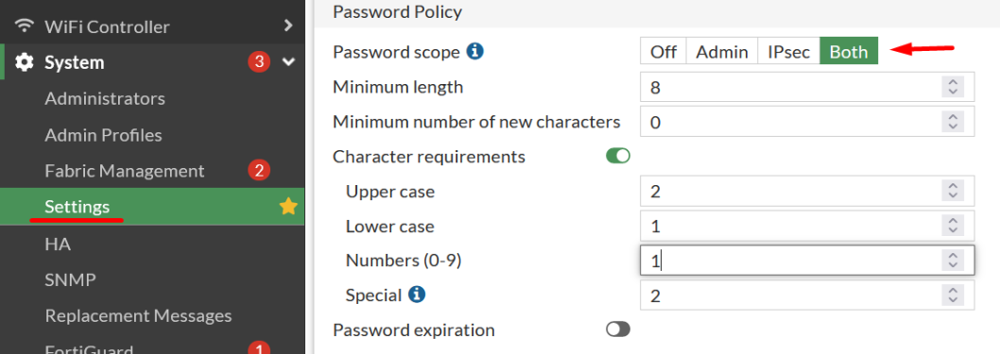
  </li>
</ol>

</details>

## SSL VPN Tunnel Mode with LDAP Users

Integrated FortiGate with the AtlasAD LDAP server, imported Active Directory users, configured an SSL VPN tunnel portal, and created a firewall policy that allowed authenticated VPN users to access an internal Windows 10 workstation through RDP.

**Implemented controls:**

- Created LDAP_Sales users and group in Active Directory.
- Connected FortiGate to the LDAP server.
- Configured SSL VPN tunnel mode with split tunneling.
- Allowed RDP from VPN users to the internal workstation.
- Validated the connection using FortiClient VPN and RDP.

<details>
<summary>View configuration evidence - SSL VPN Tunnel Mode with LDAP Users</summary>

<ol>
  <li><strong>Screenshot 1</strong><br>
    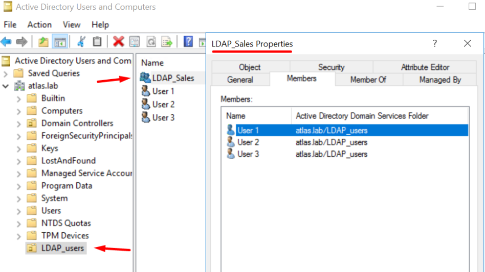
  </li>
  <li><strong>Screenshot 2</strong><br>
    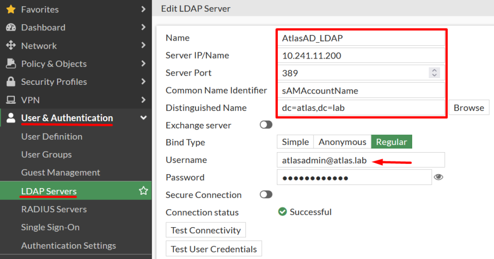
  </li>
  <li><strong>Screenshot 3</strong><br>
    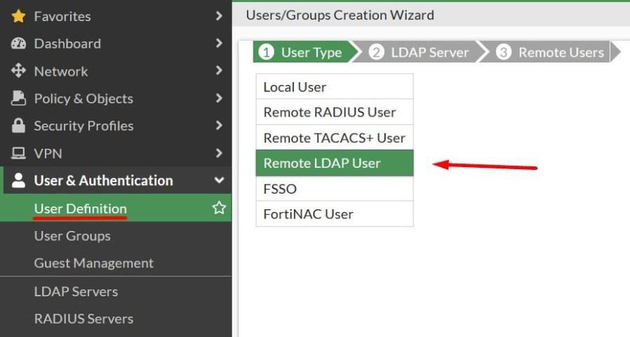
  </li>
  <li><strong>Screenshot 4</strong><br>
    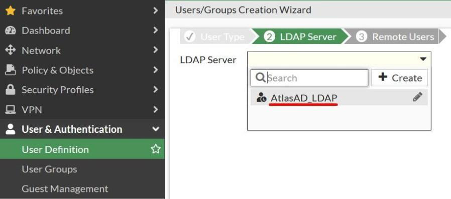
  </li>
  <li><strong>Screenshot 5</strong><br>
    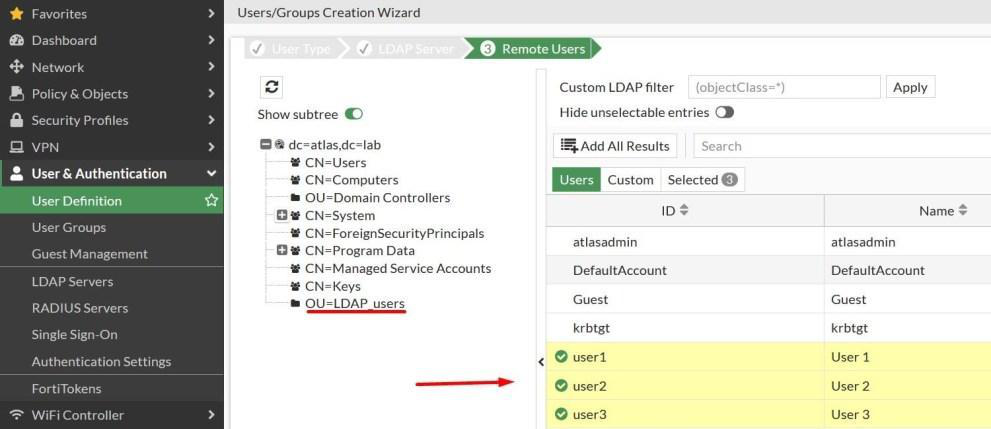
  </li>
  <li><strong>Screenshot 6</strong><br>
    
  </li>
  <li><strong>Screenshot 7</strong><br>
    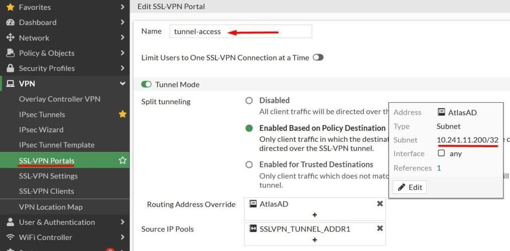
  </li>
  <li><strong>Screenshot 8</strong><br>
    
  </li>
  <li><strong>Screenshot 9</strong><br>
    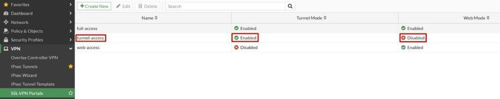
  </li>
  <li><strong>Screenshot 10</strong><br>
    
  </li>
  <li><strong>Screenshot 11</strong><br>
    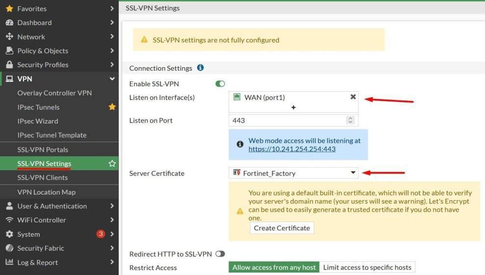
  </li>
  <li><strong>Screenshot 12</strong><br>
    
  </li>
  <li><strong>Screenshot 13</strong><br>
    
  </li>
  <li><strong>Screenshot 14</strong><br>
    
  </li>
  <li><strong>Screenshot 15</strong><br>
    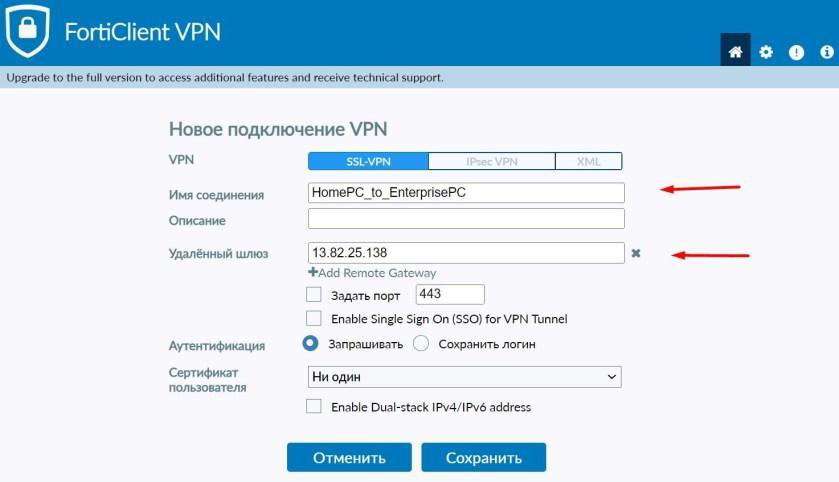
  </li>
  <li><strong>Screenshot 16</strong><br>
    
  </li>
  <li><strong>Screenshot 17</strong><br>
    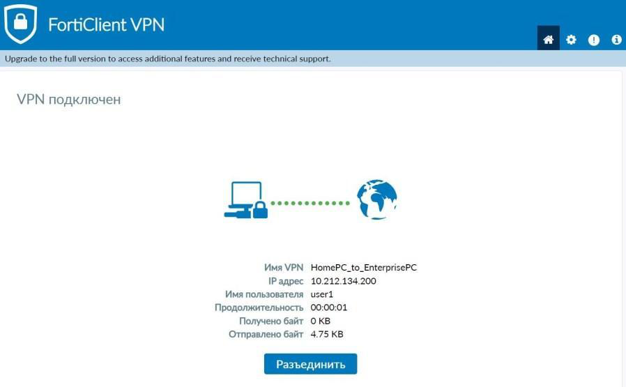
  </li>
  <li><strong>Screenshot 18</strong><br>
    
  </li>
</ol>

</details>

## SSL VPN Web Mode

Configured SSL VPN Web Mode to allow LDAP-based users to access an internal Windows workstation through a browser-based RDP bookmark. The configuration used portal mapping and a dedicated firewall policy for controlled internal access.

**Implemented controls:**

- Created LDAP_HR users and group in Active Directory.
- Configured a Web Access portal.
- Created an RDP bookmark for the internal workstation.
- Mapped LDAP users to the web portal.
- Validated browser-based RDP access.

<details>
<summary>View configuration evidence - SSL VPN Web Mode</summary>

<ol>
  <li><strong>Screenshot 1</strong><br>
    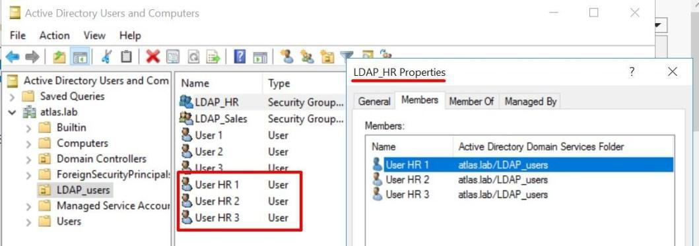
  </li>
  <li><strong>Screenshot 2</strong><br>
    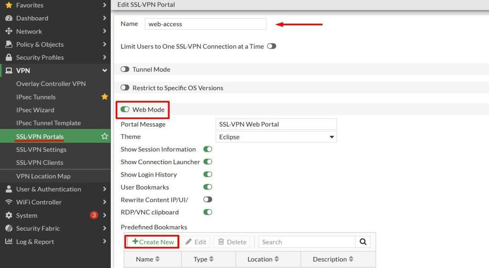
  </li>
  <li><strong>Screenshot 3</strong><br>
    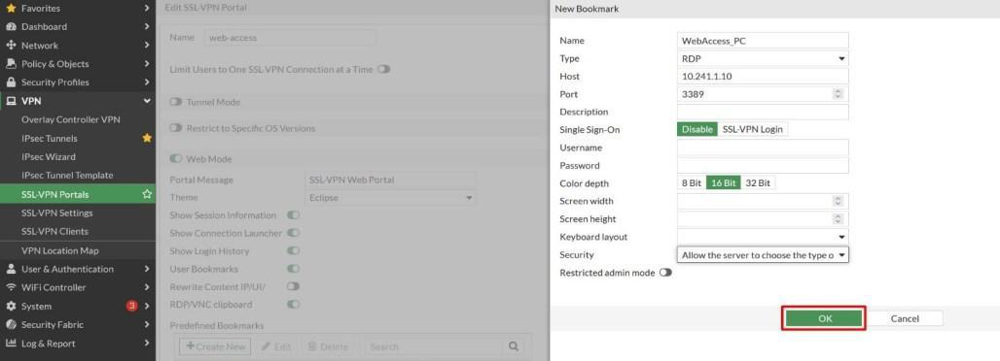
  </li>
  <li><strong>Screenshot 4</strong><br>
    
  </li>
  <li><strong>Screenshot 5</strong><br>
    
  </li>
  <li><strong>Screenshot 6</strong><br>
    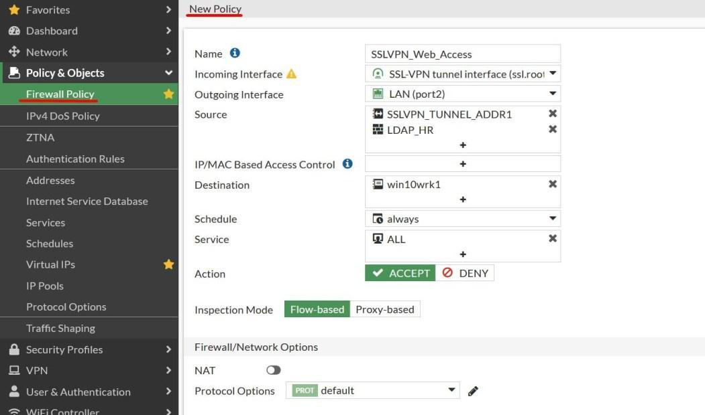
  </li>
  <li><strong>Screenshot 7</strong><br>
    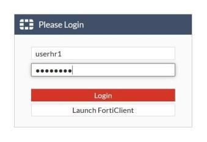
  </li>
  <li><strong>Screenshot 8</strong><br>
    
  </li>
  <li><strong>Screenshot 9</strong><br>
    
  </li>
</ol>

</details>

## Virtual IP and IIS Portal Publishing

Installed IIS on the AtlasAD server and published the internal web portal externally by creating a FortiGate Virtual IP. A firewall policy was then configured to allow inbound WAN traffic to reach the internal web service.

**Implemented controls:**

- Installed and tested IIS locally on the server.
- Created a Virtual IP object for the internal web server.
- Configured WAN-to-LAN access through a firewall policy.
- Validated external access to the portal.

<details>
<summary>View configuration evidence - Virtual IP and IIS Portal Publishing</summary>

<ol>
  <li><strong>Screenshot 1</strong><br>
    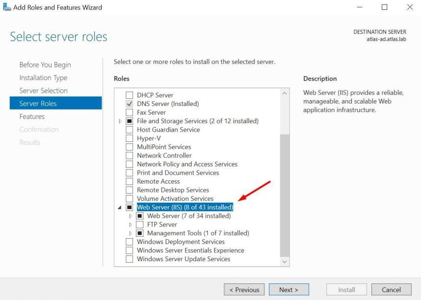
  </li>
  <li><strong>Screenshot 2</strong><br>
    
  </li>
  <li><strong>Screenshot 3</strong><br>
    
  </li>
  <li><strong>Screenshot 4</strong><br>
    
  </li>
  <li><strong>Screenshot 5</strong><br>
    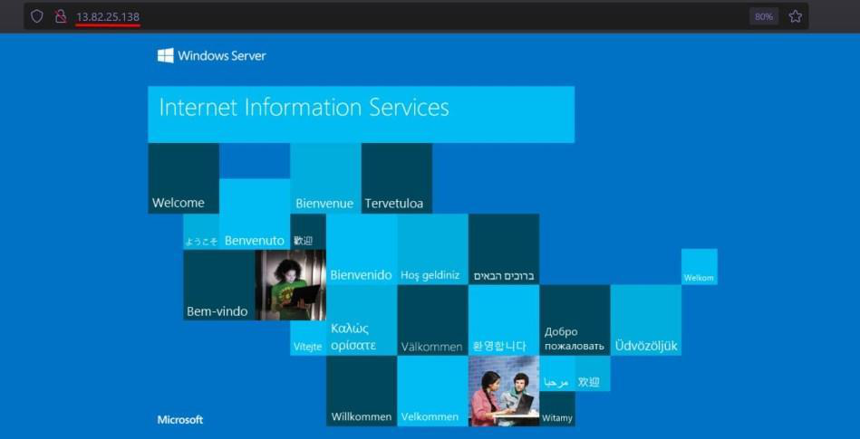
  </li>
</ol>

</details>

## Site-to-Site IPsec VPN

Built a site-to-site IPsec VPN between two FortiGate environments representing New York and Tel Aviv. The policies were restricted by service: New York was allowed to reach Tel Aviv using ICMP only, while Tel Aviv was allowed to access New York using RDP only.

**Implemented controls:**

- Created an IPsec tunnel between two FortiGate firewalls.
- Defined local and remote protected networks.
- Restricted traffic by direction and service.
- Validated tunnel status and allowed traffic.

<details>
<summary>View configuration evidence - Site-to-Site IPsec VPN</summary>

<ol>
  <li><strong>Screenshot 1</strong><br>
    
  </li>
  <li><strong>Screenshot 2</strong><br>
    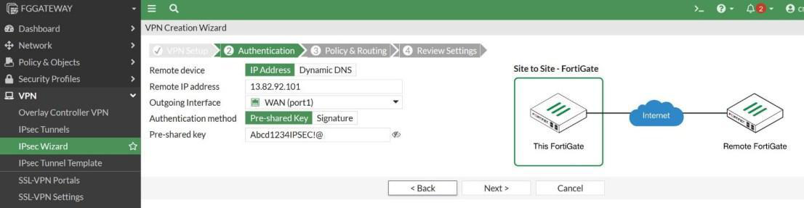
  </li>
  <li><strong>Screenshot 3</strong><br>
    
  </li>
  <li><strong>Screenshot 4</strong><br>
    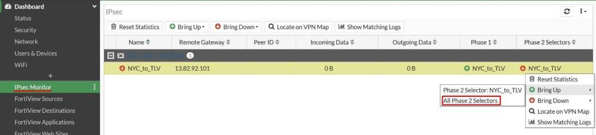
  </li>
  <li><strong>Screenshot 5</strong><br>
    
  </li>
  <li><strong>Screenshot 6</strong><br>
    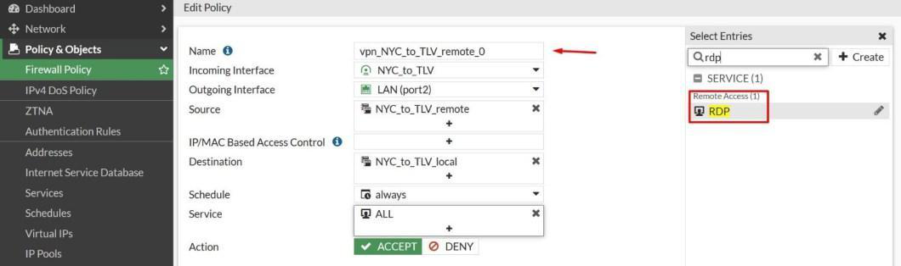
  </li>
  <li><strong>Screenshot 7</strong><br>
    
  </li>
  <li><strong>Screenshot 8</strong><br>
    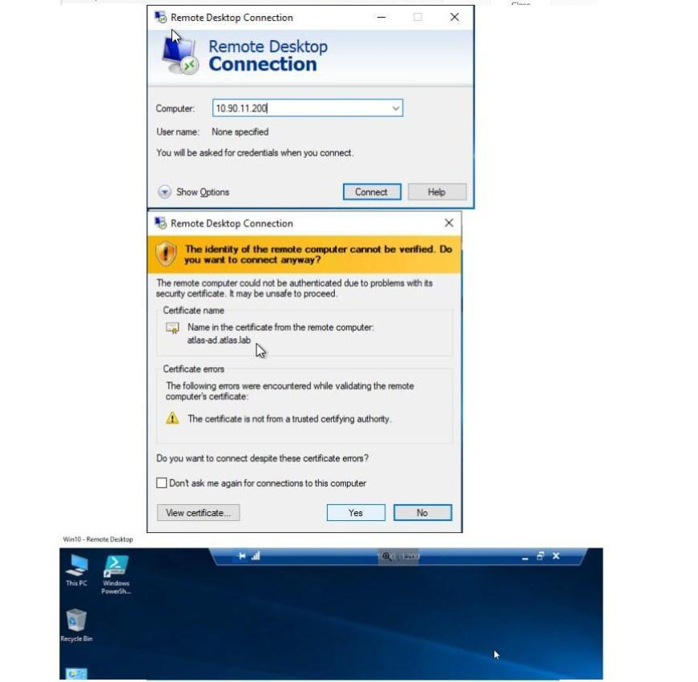
  </li>
  <li><strong>Screenshot 9</strong><br>
    
  </li>
</ol>

</details>

## SSL/TLS Inspection

Created an SSL/TLS inspection profile named Office_To_Internet_Inspection and applied it to outbound traffic. The purpose was to provide visibility into encrypted traffic so that security profiles could inspect content that would otherwise remain opaque.

**Implemented controls:**

- Created a full SSL inspection profile.
- Applied the inspection profile to outbound traffic.
- Improved inspection coverage for encrypted sessions.

<details>
<summary>View configuration evidence - SSL/TLS Inspection</summary>

<ol>
  <li><strong>Screenshot 1</strong><br>
    
  </li>
  <li><strong>Screenshot 2</strong><br>
    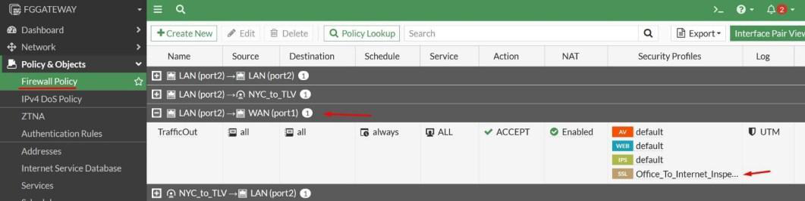
  </li>
</ol>

</details>

## Web Filter

Created a web filtering profile named Office_Web_Filter in proxy mode. The policy blocked Reddit as a static URL target and required user authentication for the Shopping category, while the profile was applied to the outbound traffic policy.

**Implemented controls:**

- Created a proxy-based web filter profile.
- Blocked reddit.com and related entries.
- Required authentication for selected web categories.
- Validated blocking and authorization behavior.

<details>
<summary>View configuration evidence - Web Filter</summary>

<ol>
  <li><strong>Screenshot 1</strong><br>
    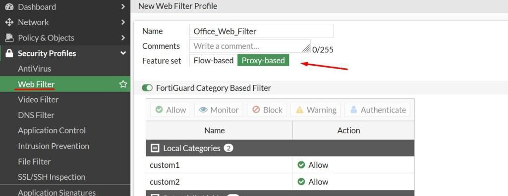
  </li>
  <li><strong>Screenshot 2</strong><br>
    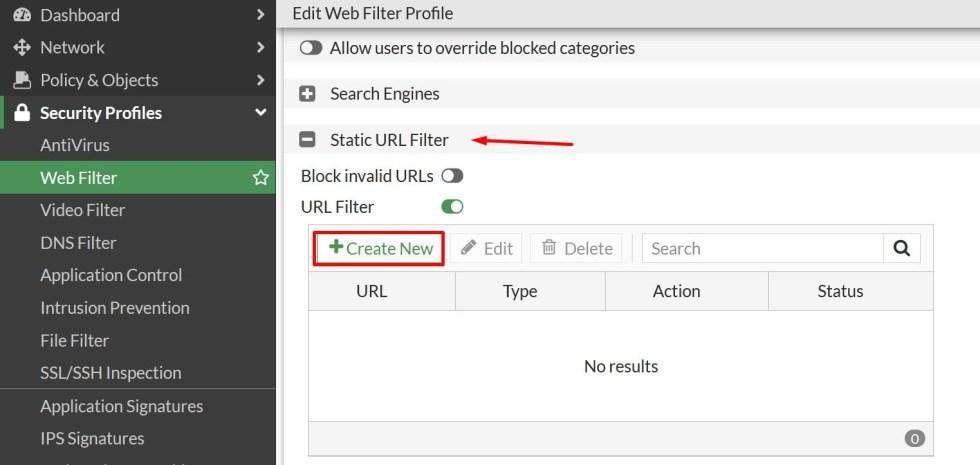
  </li>
  <li><strong>Screenshot 3</strong><br>
    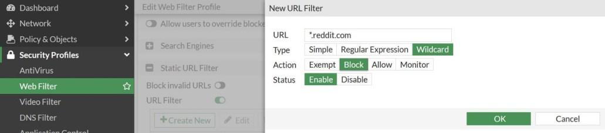
  </li>
  <li><strong>Screenshot 4</strong><br>
    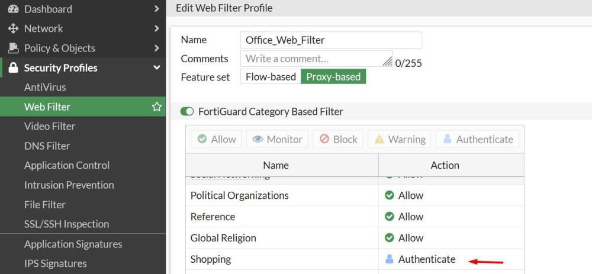
  </li>
  <li><strong>Screenshot 5</strong><br>
    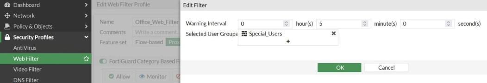
  </li>
  <li><strong>Screenshot 6</strong><br>
    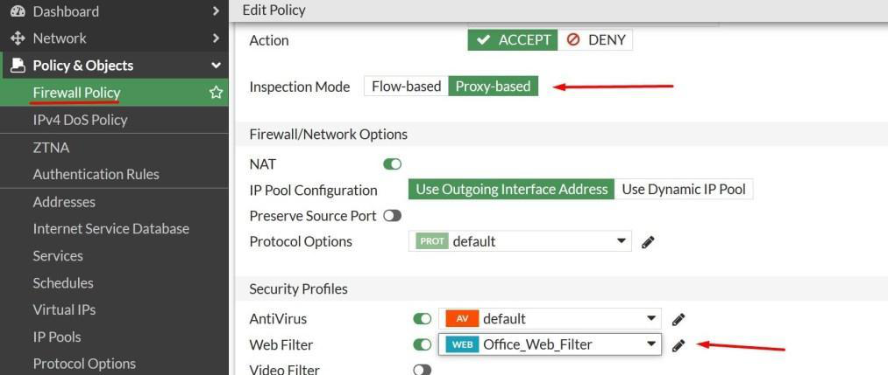
  </li>
  <li><strong>Screenshot 7</strong><br>
    
  </li>
  <li><strong>Screenshot 8</strong><br>
    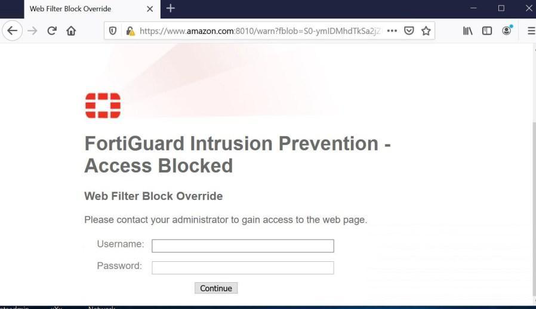
  </li>
  <li><strong>Screenshot 9</strong><br>
    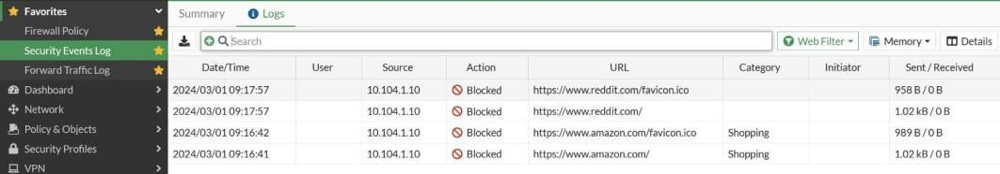
  </li>
</ol>

</details>

## DNS Filter

Created a DNS filtering profile named Office_DNS_Filter. The configuration enabled botnet and command-and-control domain protection and demonstrated domain-level blocking by marking a test domain as malicious.

**Implemented controls:**

- Enabled C&C and botnet domain blocking.
- Configured a domain filter entry.
- Applied the DNS filter to outbound traffic.
- Validated client-side block behavior.

<details>
<summary>View configuration evidence - DNS Filter</summary>

<ol>
  <li><strong>Screenshot 1</strong><br>
    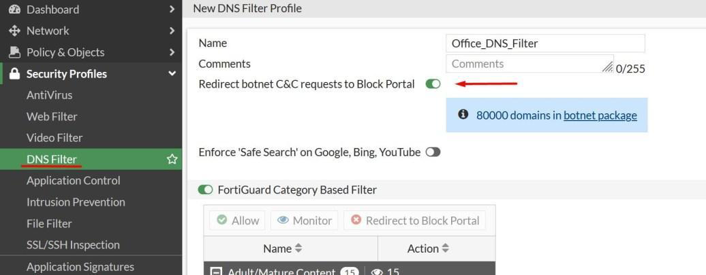
  </li>
  <li><strong>Screenshot 2</strong><br>
    
  </li>
  <li><strong>Screenshot 3</strong><br>
    
  </li>
  <li><strong>Screenshot 4</strong><br>
    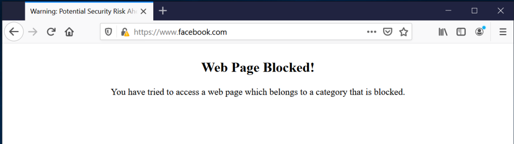
  </li>
  <li><strong>Screenshot 5</strong><br>
    
  </li>
</ol>

</details>

## Antivirus Profile

Created an antivirus profile named Office_AV_Profile in flow-based mode. The profile was applied to outbound traffic and tested by attempting to download known test malware files, with detection confirmed in FortiGate logs.

**Implemented controls:**

- Created a flow-based antivirus profile.
- Enabled scanning for common internet protocols.
- Blocked malicious test downloads.
- Reviewed detection logs.

<details>
<summary>View configuration evidence - Antivirus Profile</summary>

<ol>
  <li><strong>Screenshot 1</strong><br>
    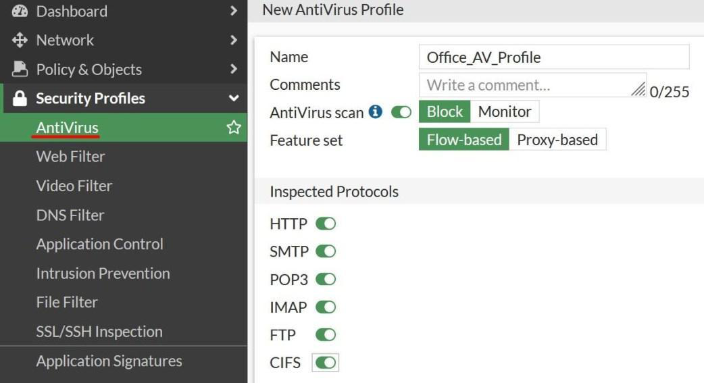
  </li>
  <li><strong>Screenshot 2</strong><br>
    
  </li>
  <li><strong>Screenshot 3</strong><br>
    
  </li>
  <li><strong>Screenshot 4</strong><br>
    
  </li>
</ol>

</details>

## IPS Profile

Created an IPS profile named Office_IPS_Profile and enabled botnet IP blocking. The profile was attached to an outbound policy and validated by testing traffic against a blocked or suspicious destination.

**Implemented controls:**

- Created an intrusion prevention profile.
- Enabled botnet and C&C-related IP blocking.
- Applied the profile to the traffic policy.
- Validated IPS logs.

<details>
<summary>View configuration evidence - IPS Profile</summary>

<ol>
  <li><strong>Screenshot 1</strong><br>
    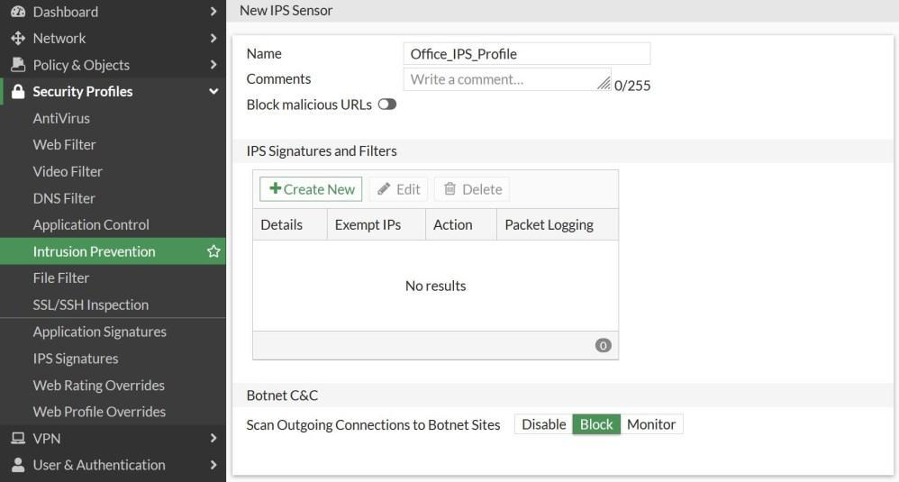
  </li>
  <li><strong>Screenshot 2</strong><br>
    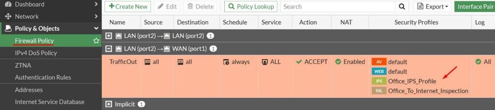
  </li>
  <li><strong>Screenshot 3</strong><br>
    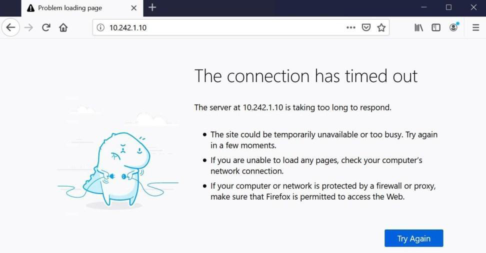
  </li>
  <li><strong>Screenshot 4</strong><br>
    
  </li>
</ol>

</details>

## Application Control and Quarantine

Created an application control profile named Office_Application_Control to block remote access tools such as TeamViewer. The profile was later configured to quarantine users for two days when matching forbidden application activity was detected.

**Implemented controls:**

- Created an application control profile.
- Blocked the Remote Access category / TeamViewer behavior.
- Applied the profile to outbound traffic.
- Configured two-day user quarantine.
- Validated the quarantine event from the dashboard.

<details>
<summary>View configuration evidence - Application Control and Quarantine</summary>

<ol>
  <li><strong>Screenshot 1</strong><br>
    
  </li>
  <li><strong>Screenshot 2</strong><br>
    
  </li>
  <li><strong>Screenshot 3</strong><br>
    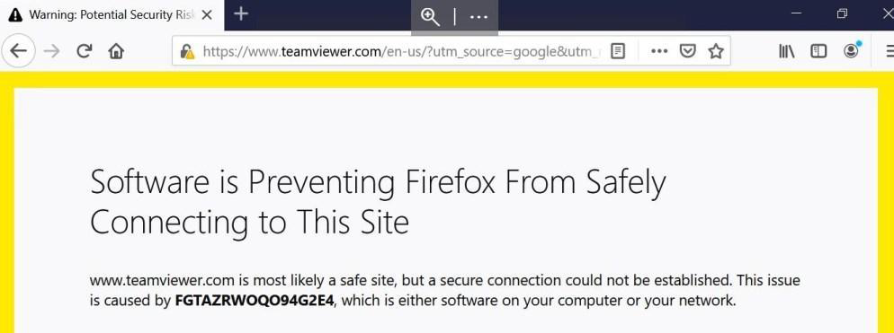
  </li>
  <li><strong>Screenshot 4</strong><br>
    
  </li>
  <li><strong>Screenshot 5</strong><br>
    
  </li>
  <li><strong>Screenshot 6</strong><br>
    
  </li>
  <li><strong>Screenshot 7</strong><br>
    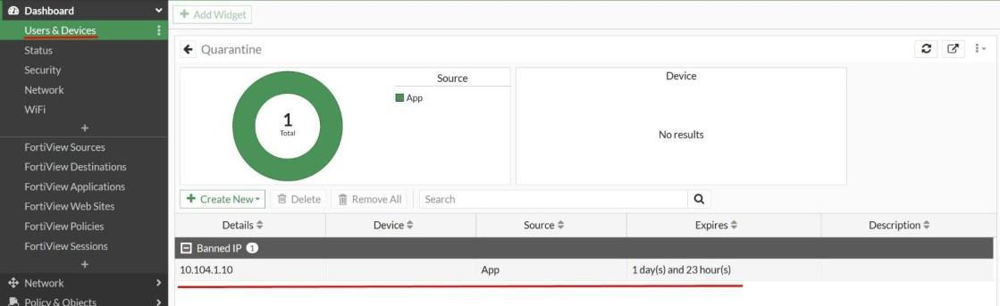
  </li>
</ol>

</details>

## Validation Summary

| Feature | Validation Method | Result |
|---|---|---|
| Custom admin profiles | Login with restricted administrator accounts | Only permitted sections were visible and editable according to profile permissions |
| Password policy | Review of FortiGate password policy settings | Complexity requirements were enforced |
| SSL VPN Tunnel Mode | FortiClient VPN login followed by RDP connection | VPN connection and RDP access were successful |
| SSL VPN Web Mode | Browser login to SSL VPN portal and RDP bookmark launch | Browser-based remote access worked |
| Virtual IP | External access to the IIS portal | Internal web service was reachable through FortiGate |
| IPsec VPN | ICMP and RDP testing across sites | Directional service restrictions were enforced |
| Web Filter | Attempted access to blocked URL and restricted category | Blocking and authentication behavior were confirmed |
| DNS Filter | Domain filtering test | Client received a block/malicious-site response |
| Antivirus | Test malware download attempt | Download was blocked and logged |
| IPS | Suspicious/malicious destination test | IPS event was logged |
| Application Control | TeamViewer / remote access category test | Application activity was blocked and quarantine was demonstrated |

## Skills Demonstrated

- FortiGate firewall administration
- Firewall policy creation and traffic control
- Role-based administrator access control
- Active Directory and LDAP integration
- SSL VPN Tunnel Mode and SSL VPN Web Mode
- RDP access control over VPN
- Virtual IP / destination NAT for internal service publishing
- Site-to-site IPsec VPN configuration
- SSL/TLS inspection profile configuration
- Web filtering, DNS filtering, antivirus, IPS, and application control
- Security event validation through FortiGate logs

## Key Takeaways

This lab demonstrates how FortiGate can be used as a central enforcement point for network segmentation, remote access, identity-aware policy control, and threat prevention. The configuration combines access control with inspection profiles, showing how firewall rules and security profiles work together to protect internal resources while still allowing required business connectivity.

## Repository Structure

```text
FortiGate-Firewall-Configuration/
|-- README.md
|-- IMAGE_MANIFEST.md
|-- images/
    |-- 01-fortigate-overview-and-network-topology/
    |   |-- 01.png
    |   |-- 02.png
    |-- 02-user-management-and-rbac/
    |   |-- 01.png
    |   |-- ...
```

## Notes

- This repository is based on a controlled lab environment.
- Screenshots were extracted from the original PDF report and inserted as local repository assets.
- Before publishing, review screenshots for any sensitive values such as real public IP addresses, usernames, domains, or environment-specific identifiers.
